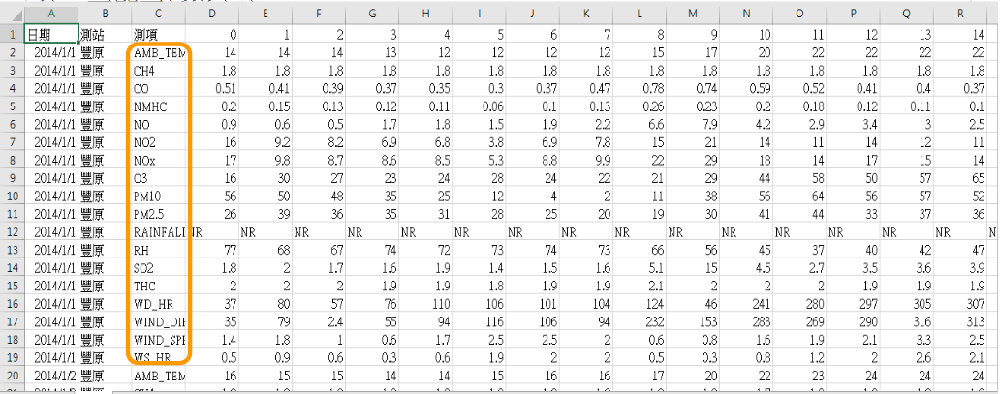
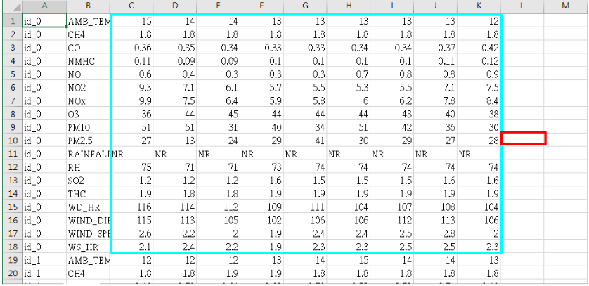
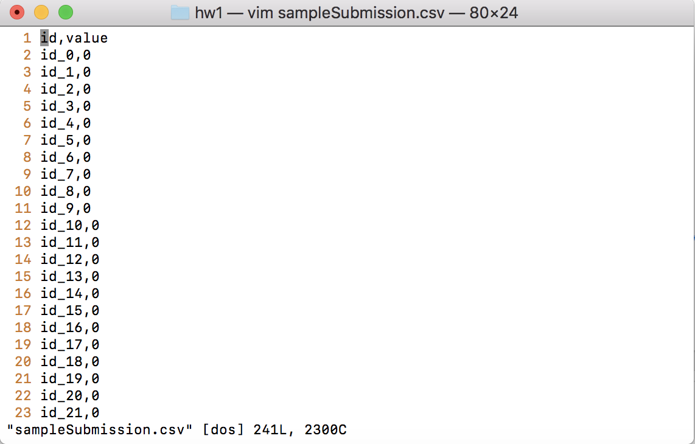
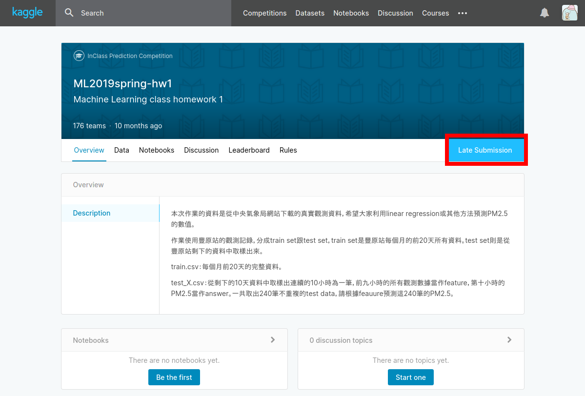

# HW1 - Linear Regression

## Intro - PM2.5 Prediction

### Tasks Description

- 本次作業的資料是從行政院環境環保署空氣品質監測網所下載的觀測資料。
- 希望大家能在本作業實作 linear regression 預測出 PM2.5 的數值。

### Data Description

- 本次作業使用豐原站的觀測記錄，分成train set跟test set，train set是豐原站每個月的前 20 天所有資料。test set 則是從豐原站剩下的資料中取樣出來。
  - train.csv: 每個月前 20 天的完整資料。
  - test.csv: 從剩下的資料當中取樣出連續的 10 小時為一筆，前九小時的所有觀測數據當作 feature，第十小時的 PM2.5 當作 answer。一共取出 240 筆不重複的 test data，請根據 feature 預測這 240 筆的 PM2.5。
- Data 含有 18 項觀測數據：AMB_TEMP, CH4, CO, NHMC, NO, NO2, NOx, O3, PM10, PM2.5, RAINFALL, RH, SO2, THC, WD_HR, WIND_DIREC, WIND_SPEED, WS_HR。

### Training Data

### Testing Data

### Sample Submission

- 預測 240 筆 testing data 中的 PM2.5 值，將預測結果上傳至 kaggle
  - Upload format: csv file
  - 第一行必須是 `id,value`
  - 第二行開始，每行分別為 id 值及預測 PM2.5 數值，以逗號隔開
- 範例格式：
  

## Kaggle

- 請自行到 kaggle 創建帳號
- Link: <https://www.kaggle.com/c/ml2019spring-hw1>
- 點選 Late Submission 加入競賽
  
- 個人進行、不須組隊
- Maximum Daily Submission: 5 times
- test.csv 的 240 筆資料分為：120 筆 public、120 筆 private

### Kaggle Baselines

-Public Leaderboard
  - 120 out of 240 from the testing dataset
  - Participants receive instant feedback about their performance.
  - Be sure not to overfit on the public leaderboard.
- Private Leaderboard
  - 120 out of 240 from the testing dataset

## Assignment Regulation

- Only Python 3.6 available!!!
- 開放使用套件
  - numpy >=1.14
  - scipy == 1.2.1
  - pandas >= 0.24.1
  - python standard library
  - numpy.linalg.lstsq是不可以用的!!!
- 請實作 linear regression，方法限定使用 Gradient Descent。
- hw1_best.sh 不限做法，開放以下套件（但有版本限制請注意）
  - pytorch == 1.0.1
  - tensorflow == 1.12.0
  - keras == 2.2.4
  - scikit-learn == 0.20.0
- hw1.sh
  - Please handcraft "linear regression" using Gradient Descent
  - beat public simple baseline
- hw1_best.sh
  - meet the higher score you choose in kaggle
  - You can use any

## Handin Format

- Kaggle : **pass simple and strong baseline** (由於目前算是 late submission，因此不會出現在 leaderboard 上，可直接將最佳成績截圖上傳)
- Github code & report
  - 你的 github 上至少有下列 3 個檔案（格式必須完全一樣）：
    - ML2019SPRING/hw1/report.pdf
    - ML2019SPRING/hw1/hw1.sh
    - ML2019SPRING/hw1/hw1_best.sh
  - 請使用 **git push**, 避免直接上傳檔案
- 請勿上傳 train.csv，test.csv 等等 dataset!!!
- 你的 github 上可能還有其他檔案：
  e.g. ML2019SPRING/hw1/model.npy
- 注意!!!hw1.sh 將只執行 testing，請自行跑完 training 部分並且儲存相關模型參數並上傳至 github
- Report 模板連結：<https://docs.google.com/document/d/1n9GeHikNOUeckA6WV-gDASSg_gqzgvoqQMZX0QJv1xc/edit>
